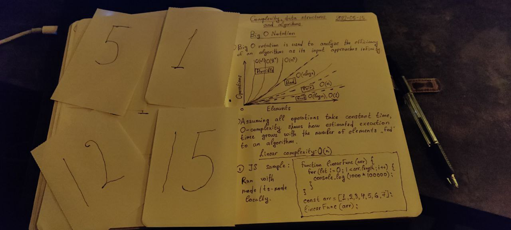

# MeLearning 🎓

Repo I made to track the way I learn and/or retell fundamental CS concepts.
I want to be a better professional and thus I need to have a solid foundation.
I use both markdown and hand-written notes for learning purposes as well as cards for memorizing algorithms.

**I do my best to learn and/or retell important concepts every day.**

